# 安装 

推荐使用从官网上下载的方式安装
在浏览器上输入以下内容或直接点击[链接](https://womadao.top)进入官网
```
    womadao.top
```
进入到官网的页面之后，点击下载客户端（如图所示）

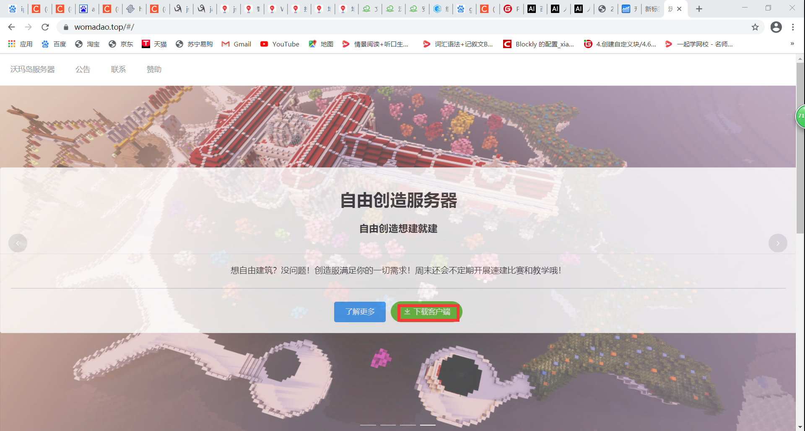
下载之后把压缩包进行解压并复制到桌面上即可
****************************************************************
# 快速上手
## 安装依赖
请点击[这里](https://www.java.com/zh-CN/)或输入以下网址来进入java官网
```
    https://www.java.com/zh-CN/
```
点击免费Java下载（如图所示）
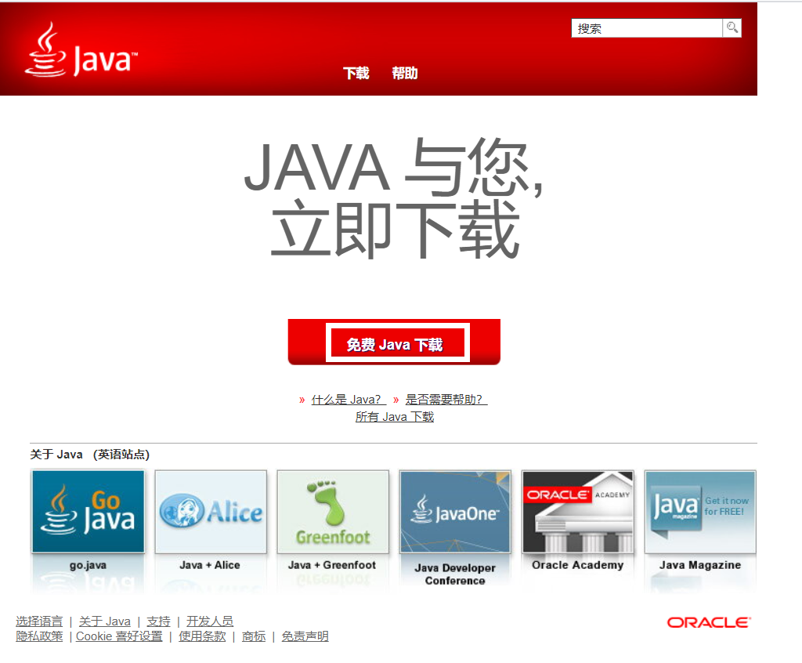
点击同意并开始免费下载（如图所示）

下载完点击安装程序，当出现以下界面时则说明下载成功
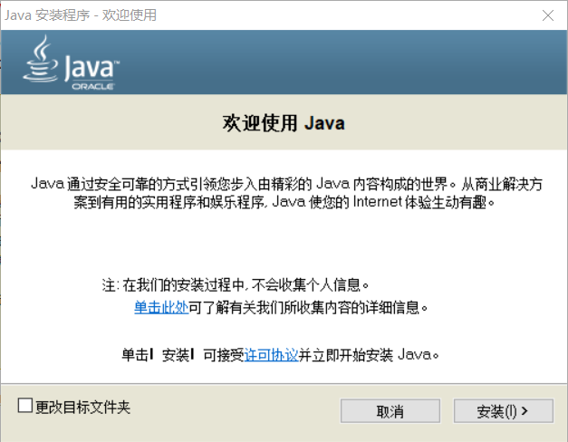

点击安装(I)>按钮
当出现以下界面时，说明正在安装依赖

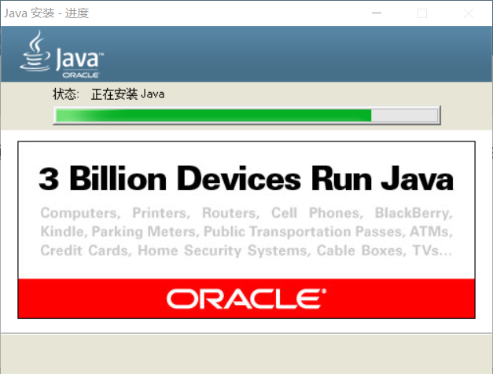

若出现此界面时，则安装依赖成功

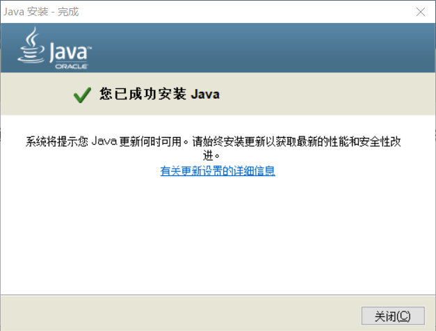
## 运行程序
请进入您解压客户端的目录下来执行以下操作。

请确保您的目录下的文件完好。否则无法执行该操作。

请查看您的系统的位数来进行目录的选择

### 32位(x86)

请自行下载hmcl客户端且安装1.14的我的世界的客户端（不装任何mod）（安装过程自行百度）
### 64位(x64)
点击```沃玛岛整合包（内含已加载的小地图）```文件夹
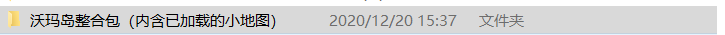

进入之后，双击```HMCL-3.3.172.exe```（如图所示）
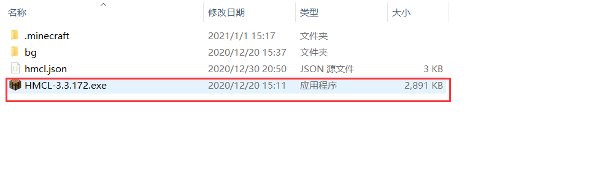

进入之后会显示以下界面
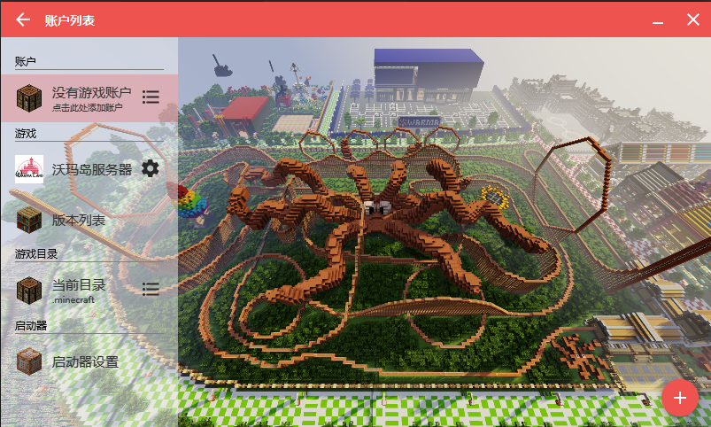

点击游戏帐户（如图所示）
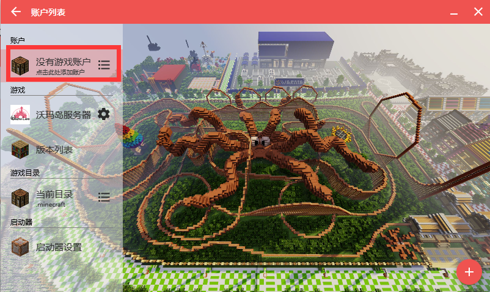

点击```+```号标识按钮（如图所示）
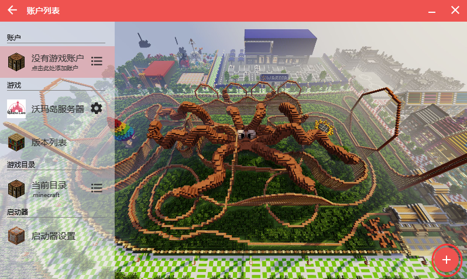

现在就在图中红色区域输入你的名字吧
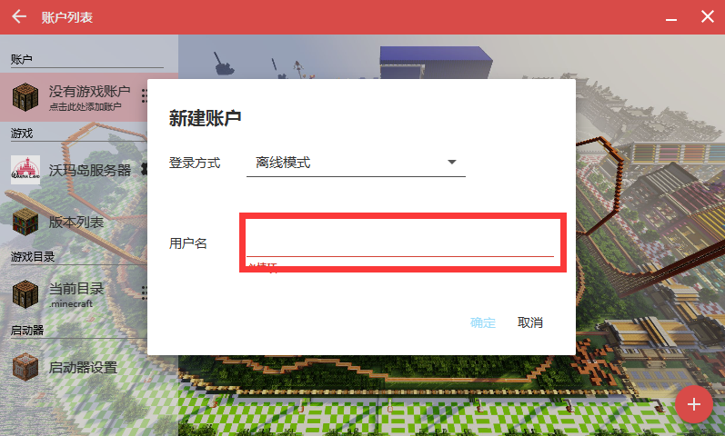

接着再点击确定按钮（如图所示）
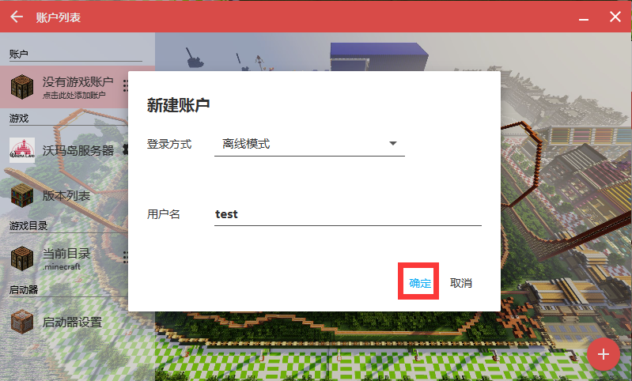

接着再点击返回按钮（如图所示）
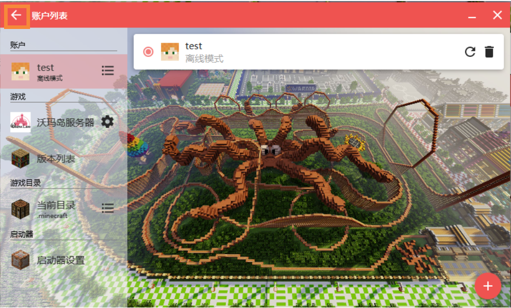

接着再点击启动游戏按钮（如图所示）
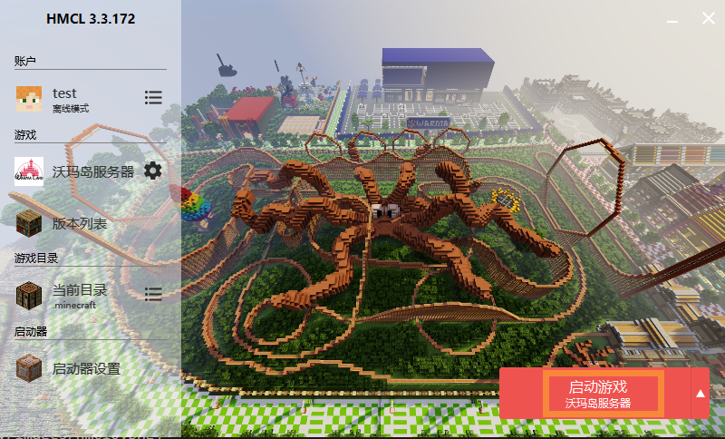

出现此页面表明游戏正在加载中
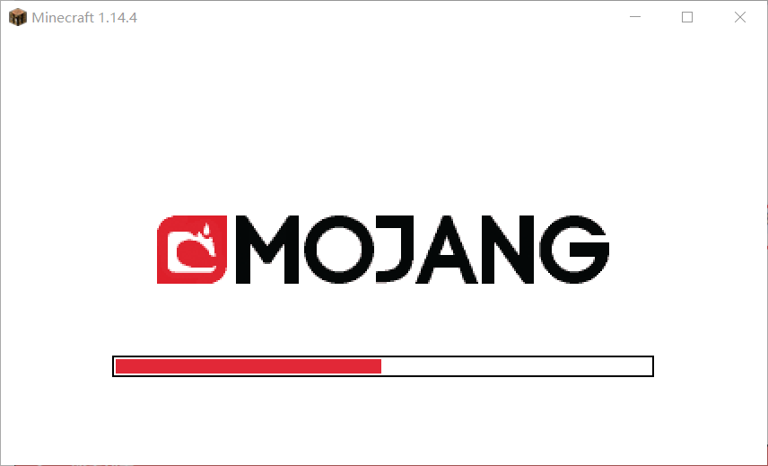

出现此页面表明游戏已经加载成功
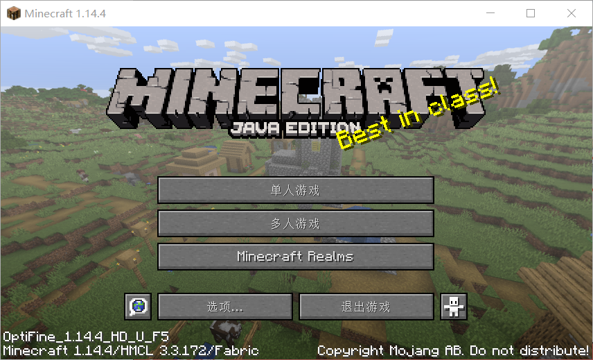

在此页面中选择多人游戏
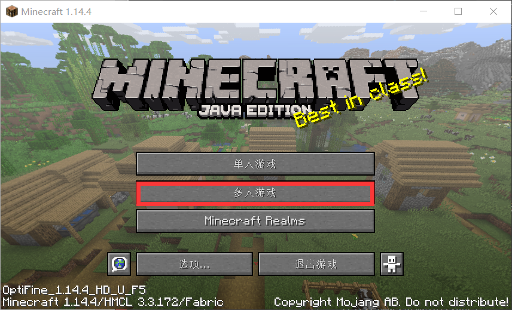

之后会出现这样的界面
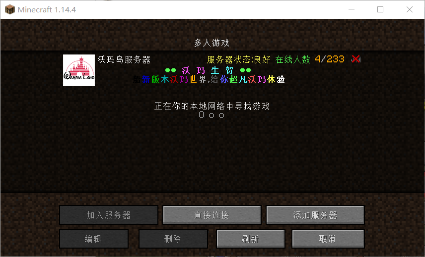

点击沃玛岛服务器
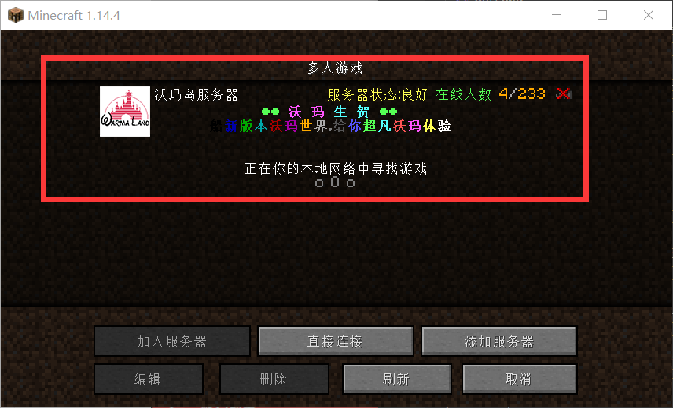

即可进入服务器

当然您还需要注册或者登陆才能玩

可以移步到我们的命令里查看

*****************************
# 命令
## 登陆
``` 
/l <上次注册的密码> 
```

## 注册
``` 
/reg <密码> <再次确认密码> 
```
## 打开主菜单
``` 
/c 
```
## 打开时钟
``` 
/c 
```
## 打开生存菜单
```
/sc 
```
## 随机传送
```
/tpr
```
## 传送到玩家
```
/tpa
```
## 圈地
```
/res
```
## 领地
```
/plot
```
## 沃玛币
```
/money
```
## 帮助
```
/help
```
